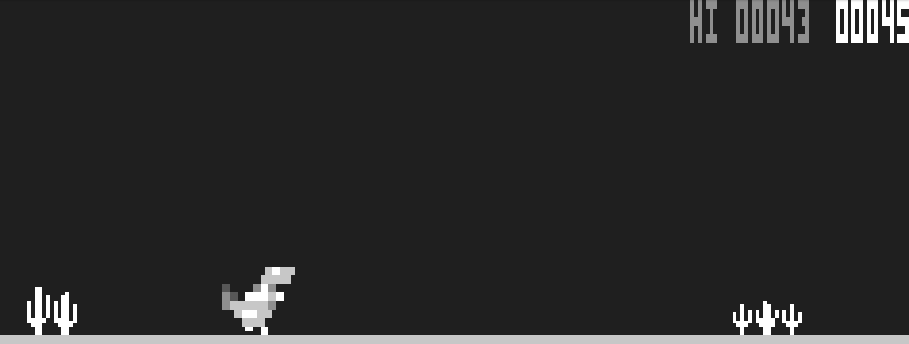

# DINO GAME


The Dino Game is a retro-style game where the player controls a dinosaur across an endlessly side-scrolling landscape. The objective is to help the dinosaur survive as long as possible by avoiding obstacles such as cacti and pterosaurs through jumping or ducking. The game's difficulty gradually increases as the dinosaur's speed accelerates and new obstacles appear, offering an engaging and challenging experience. The gameplay is simple yet addictive, encouraging players to achieve the highest score and top the leaderboard.

## Project Background

This game was developed as a project for my Data Structures class. It demonstrates practical applications of data structures in game development, particularly the use of dynamic ordered lists for efficiently managing and storing high scores. This project not only showcases fundamental concepts of data structures but also provides an engaging way to understand their importance in real-time applications.

## Features

- **Dynamic Difficulty:** The game becomes more challenging as the dinosaur's speed increases and new obstacles appear.
- **Leaderboard Management:** Scores are stored in a dynamic ordered list, allowing for efficient identification of the highest-scoring players.
- **User-Friendly Interface:** Simple and intuitive controls make the game accessible and enjoyable for all players.

## Build Process

To build the program, you need to run the following commands:

1. Compile the program using `g++`:
    ```sh 
    g++ main.cpp -o p 
    ```

2. Run the program:
    ```sh 
    ./p
    ```

## MAIN MENU

When the game starts, the main menu prominently displays the game's name ("Dino Game"), below which three options are available: new game, leaderboard, and exit. The user can easily navigate through the options using the up and down arrows, and confirm their selection with the Enter key.

## LEADERBOARD

The leaderboard displays the highest scores in descending order, which the user can easily browse using the up and down arrows. To return to the main menu, the user can press the BACKSPACE key.

## NEW GAME

When starting a new game, the player can enter a username, which can be up to 16 characters long and can include numbers, letters, and underscores. If the player changes their mind and wants to return to the main menu, they can do so by pressing the ESC key.

## GAMEPLAY

During the game, the top left corner shows which players are above the current score on the leaderboard, while the right side displays the record score and the current score. Cacti and pterosaurs must be avoided by jumping or ducking. Jumping can be performed using the W key, the up arrow, or the spacebar, while ducking is done by pressing the down arrow or the S key once. To stand up, the ducking key must be pressed again. If the player wants to jump while ducking, the dinosaur will immediately stand up and jump. The game ends when the dinosaur hits an obstacle.

## GAME OVER SCREEN

When the dinosaur hits an obstacle and dies, the game over screen appears. It prominently displays "Game Over," and if the player has set a new record, this is also indicated. The player has three options: start a new game, return to the main menu, or exit. The "new game" option allows the player to start a new game without having to re-enter their username.

